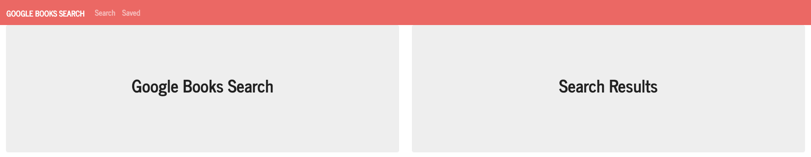

# Google-Books-React-Search

## Description

  Welcome to Google Books React Search! In this application, requirements stated to create React components, work with helper/util functions, and utilize React lifecycle methods to query and display books based on user searches. Other technologies that helped fuel this app are Node, Express and MongoDB so that users can save books to review or purchase later.

  

  

  

  

  ## Table of Contents
  
  - [Installation](#installation)
  - [Testing](#tests)
  - [Usage](#usage)
  - [License](#license)
  - [Contributors](#contributors)
  - [Link to Deployed Application](#link)
  - [Questions](#questions)

  ## Installation

  - Run Command: npm run start

  ## Tests
  
  - Run Command: None

  ## Usage

  - This application was created using React.js. Please see installation instructions and tests for more information.

  ## License

  

  ## Contributors

  - None
  
  ## Link

  - https://google-books-react-upenn.herokuapp.com/

  ## Questions? 
  
  - Feel free to contact me at ksmera01@gmail.com